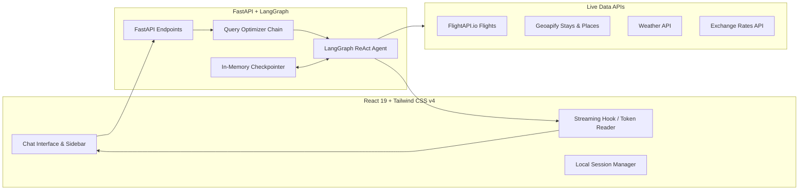

# 🌍 AI Travel Planner

A full-stack, autonomous AI travel planning companion that understands natural language trip requests, resolves destination details, queries live flights and hotels, converts currencies, calculates budgets with exact arithmetic, and crafts personalized multi-day itineraries in real time.

Built with **LangGraph**, **FastAPI**, **ChatMistralAI**, **FlightAPI.io**, **Geoapify**, **React 19**, and **Tailwind CSS v4**.

---

## 📸 Key Features

- 🧠 **Autonomous LangGraph Agent**: Powered by ChatMistralAI (`ministral-3b-latest`) with conversational memory checkpointer (`InMemorySaver`).
- ✈️ **Live Flight Search**: Real-time multi-vendor flight price comparison using [FlightAPI.io](https://www.flightapi.io/) for one-way and round-trip journeys across hundreds of airlines.
- 🏨 **Hotel & Activity Discovery**: Powered by [Geoapify](https://www.geoapify.com/) Places and Place Details APIs for accommodations, attractions, and dining.
- 🌦️ **Weather Forecasts**: Multi-day destination forecasts to optimize your packing and activity schedules.
- 💱 **Live Currency Conversion**: On-the-fly exchange rates to ensure you understand your budget in your home currency.
- 🧮 **Deterministic Arithmetic**: Offloads all budget subtotals, sums, and percentages to deterministic calculator tools to eliminate LLM arithmetic errors.
- 💡 **Intelligent Query Optimizer**: Automatically corrects typos, resolves travel dates to future years, and proactively asks clarification questions if critical travel information (like origin city for flights) is missing.
- ⚡ **Real-Time Token Streaming**: Server-Sent Streaming (`/api/chat/stream`) enables instantaneous UI feedback as the agent reasons and generates plans.
- 🎨 **Modern Spotify-Inspired Dark & Light Themes**: Refined interface featuring deep gray dark mode (`#121212`) and clean white light mode with responsive typography and collapsible session sidebar.
- 💬 **Session & Thread Management**: Multiple concurrent travel planning sessions saved in local storage.

---

## 🏗️ System Architecture



---

## 📂 Project Structure

```
ai-travel-planner/
├── ai-service/                   # FastAPI & LangGraph Backend
│   ├── agent/
│   │   ├── travel_agent.py       # Compiled LangGraph agent with Mistral AI & tools
│   │   └── query_optimizer.py    # Intent extraction and clarification engine
│   ├── prompts/
│   │   └── system_prompt.py      # Core agent guidelines, tool rules & constraints
│   ├── tools/                    # Modular LangChain tools
│   │   ├── flights.py            # FlightAPI.io live search (one-way & round-trip)
│   │   ├── accommodations.py     # Geoapify hotel search
│   │   ├── places.py             # Geoapify attractions & restaurant discovery
│   │   ├── weather.py            # Destination weather forecast
│   │   ├── currency.py           # Real-time exchange rates
│   │   └── calculator.py         # Deterministic arithmetic
│   ├── main.py                   # FastAPI app with sync & streaming endpoints
│   ├── requirements.txt          # Python dependencies
│   └── README.md                 # Backend-specific documentation
│
└── frontend/                     # React 19 + Vite Frontend
    ├── src/
    │   ├── components/           # UI components (ChatBox, QuickPrompts, Sidebar, ThemeToggle)
    │   ├── context/              # Session and Theme contexts
    │   ├── hooks/                # Streaming and message management hooks
    │   ├── App.tsx               # Main application component
    │   └── main.tsx              # React DOM root
    ├── package.json              # Frontend dependencies
    └── vite.config.ts            # Vite configuration
```

---

## 🛠️ Tech Stack

| Domain | Technologies |
| :--- | :--- |
| **Frontend** | React 19, TypeScript, Vite, Tailwind CSS v4, Lucide Icons |
| **Backend** | Python 3.11+, FastAPI, Uvicorn, Pydantic |
| **Orchestration & LLM** | LangGraph, LangChain, ChatMistralAI (`ministral-3b-latest`) |
| **Live Travel APIs** | FlightAPI.io, Geoapify, Open-Meteo, Exchange Rates API |

---

## 🚀 Quickstart Guide

### Prerequisites
- Python 3.11+ installed
- Node.js 18+ and npm installed
- API Keys:
  - [Mistral AI](https://console.mistral.ai/) (Required for LLM)
  - [FlightAPI.io](https://www.flightapi.io/) (Required for live flight search)
  - [Geoapify](https://www.geoapify.com/) (Required for hotels & places)

---

### 1. Clone the Repository

```bash
git clone https://github.com/pratikkad10/Ai-travel-planner.git
cd "Ai-travel-planner"
```

---

### 2. Backend Setup (`ai-service`)

1. Navigate to the backend directory:
   ```bash
   cd ai-service
   ```

2. Create and activate a Python virtual environment:
   ```bash
   # Windows (PowerShell):
   python -m venv .venv
   .venv\Scripts\activate

   # macOS / Linux:
   python -m venv .venv
   source .venv/bin/activate
   ```

3. Install requirements:
   ```bash
   pip install -r requirements.txt
   ```

4. Configure environment variables in `ai-service/.env`:
   ```env
   MISTRAL_API_KEY=your_mistral_api_key
   FLIGHTAPI_KEY=your_flightapi_key
   GEOAPIFY_API_KEY=your_geoapify_api_key

   # Optional: LangSmith Observability
   LANGSMITH_API_KEY=your_langsmith_api_key
   LANGSMITH_TRACING=true
   ```

5. Test the flight search tool:
   ```bash
   python tools/flights.py
   ```

6. Start the FastAPI server:
   ```bash
   uvicorn main:app --reload --port 8000
   ```
   Interactive Swagger docs will be available at `http://localhost:8000/docs`.

---

### 3. Frontend Setup (`frontend`)

Open a new terminal window:

1. Navigate to the frontend directory:
   ```bash
   cd frontend
   ```

2. Install dependencies:
   ```bash
   npm install
   ```

3. (Optional) Configure API Base URL in `frontend/.env`:
   ```env
   VITE_API_BASE_URL=http://localhost:8000
   ```
   *(Defaults to `http://localhost:8000` if omitted)*

4. Start the Vite development server:
   ```bash
   npm run dev
   ```

5. Open `http://localhost:5173` in your browser.

---

## 🔌 API Endpoints Summary

| Method | Endpoint | Description |
| :--- | :--- | :--- |
| `GET` | `/health` | Server health check |
| `POST` | `/api/chat` | Synchronous chat turn with LangGraph agent |
| `POST` | `/api/chat/stream` | Server-Sent streaming response for real-time token rendering |

---

## 🚢 Deployment

### Backend (Railway / Render)
- Set root directory to `ai-service`.
- Start Command: `uvicorn main:app --host 0.0.0.0 --port $PORT`
- Set environment variables (`MISTRAL_API_KEY`, `FLIGHTAPI_KEY`, `GEOAPIFY_API_KEY`).

### Frontend (Vercel / Netlify)
- Set root directory to `frontend`.
- Build Command: `npm run build`
- Output Directory: `dist`
- Environment Variable: `VITE_API_BASE_URL` = `https://your-backend-service.up.railway.app`

---

## 📄 License

This project is licensed under the MIT License.
