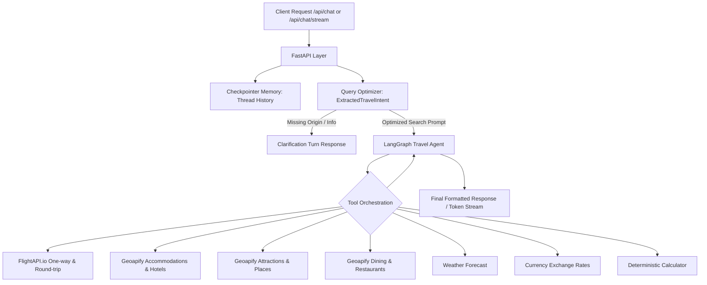

# 🧠 AI Travel Planner — Backend Service (`ai-service`)

The backend engine for the **AI Travel Planner** is a high-performance **FastAPI** service powered by a **LangGraph** autonomous agent and **ChatMistralAI** (`ministral-3b-latest`). It handles real-time travel query understanding, intelligent constraint extraction, multi-tool orchestration, live data retrieval, currency conversion, and real-time streaming responses.

---

## 🌟 Architecture Overview



### Key Modules:
- **`agent/travel_agent.py`**: Compiles the LangGraph ReAct agent with checkpointer memory (`InMemorySaver`), integrating all tools with Mistral AI.
- **`agent/query_optimizer.py`**: Pre-processing chain that cleans user queries, enforces future dates, maps informal city names, and automatically asks clarification questions if crucial info (such as origin city for flights) is missing.
- **`prompts/system_prompt.py`**: Strict system instructions enforcing factual tool use, transparent reporting, zero hallucinations, and separated responsibilities.
- **`tools/`**: Modular tool collection providing live data integration.

---

## 🛠️ Tool Ecosystem

| Tool | Source / Provider | Description |
| :--- | :--- | :--- |
| `search_flights` | [FlightAPI.io](https://www.flightapi.io/) | Live one-way and round-trip flight search across hundreds of airlines and OTAs. Returns prices, times, flight numbers, stops, and durations. |
| `search_hotel_places` | [Geoapify](https://www.geoapify.com/) | Live hotel, resort, and accommodation searches by city, ratings, and locations. |
| `search_places` | Geoapify Places | Tourist attractions, historical landmarks, museums, and activities. |
| `search_restaurants` | Geoapify Places | Dining options, cafes, and local cuisine spots. |
| `get_place_details` | Geoapify Place Details | Contact info, opening hours, facilities, and descriptions for specific spots. |
| `fetch_weather_forecast` | Open-Meteo / Weather API | Multi-day weather forecasts, temperatures, and conditions for destinations. |
| `fetch_currency_exchange_rate` | Exchange Rates API | Real-time foreign exchange rate conversion. |
| `calculator` | Deterministic Math | Precise arithmetic calculations (`add`, `subtract`, `multiply`, `divide`, `percentage`) to ensure budget accuracy. |

---

## ⚙️ Environment Variables

Create a `.env` file inside `ai-service/`:

```env
# Mistral AI API Key (Required for LLM and Query Optimizer)
MISTRAL_API_KEY=your_mistral_api_key

# FlightAPI.io API Key (Required for live flight searches)
FLIGHTAPI_KEY=your_flightapi_key
# Alternatively: FLIGHT_MCP_API_KEY=your_flightapi_key

# Geoapify API Key (Required for hotels, places, and restaurants)
GEOAPIFY_API_KEY=your_geoapify_api_key

# LangSmith (Optional, for agent tracing and observability)
LANGSMITH_API_KEY=your_langsmith_api_key
LANGSMITH_TRACING=true
```

> [!NOTE]
> FlightAPI.io requests consume **2 credits** per search. Ensure you have an active account with credits at [FlightAPI.io](https://www.flightapi.io/).

---

## 🚀 Getting Started

### 1. Create and Activate Virtual Environment

```bash
# Navigate to ai-service
cd ai-service

# Create virtual environment
python -m venv .venv

# Activate on Windows:
.venv\Scripts\activate

# Activate on macOS / Linux:
source .venv/bin/activate
```

### 2. Install Dependencies

```bash
pip install -r requirements.txt
```

### 3. Test Individual Tools (Optional)

You can verify that your API keys and tools work independently:

```bash
# Test live flight search
python tools/flights.py

# Test accommodations
python tools/accommodations.py

# Test weather
python tools/weather.py
```

### 4. Run the FastAPI Server

```bash
uvicorn main:app --reload --port 8000
```

The interactive OpenAPI documentation will be accessible at:
- **Swagger UI**: `http://localhost:8000/docs`
- **ReDoc**: `http://localhost:8000/redoc`

---

## 🔌 API Reference

### 1. Health Check
- **Endpoint**: `GET /health`
- **Response**: `{"status": "ok"}`

### 2. Synchronous Chat
- **Endpoint**: `POST /api/chat`
- **Request Body**:
  ```json
  {
    "message": "Plan a 3-day trip to Goa from Mumbai for next month with flights and hotels.",
    "thread_id": "session-123"
  }
  ```
- **Response**:
  ```json
  {
    "response": "Here is your 3-day trip plan to Goa...",
    "thread_id": "session-123"
  }
  ```

### 3. Server-Sent Streaming Chat
- **Endpoint**: `POST /api/chat/stream`
- **Request Body**:
  ```json
  {
    "message": "Find flights from Delhi to Bangalore on 2026-10-15.",
    "thread_id": "session-123"
  }
  ```
- **Response**: Live token text stream (`text/plain`).

---

## 🧪 Testing & Validation

```bash
# Run standalone flight tool verification
python tools/flights.py
```

Expected output format:
```python
{
    'success': True,
    'origin': 'BOM',
    'destination': 'GOA',
    'departure_date': '2026-10-15',
    'adults': 2,
    'cabin': 'Economy',
    'currency': 'INR',
    'total_offers': 82,
    'offers': [...]
}
```
